# SpreadsheetApp - 简易电子表格软件

[](https://github.com/YJsnz/class_design/stargazers)
[](https://github.com/YJsnz/class_design/network/members)

## 项目简介

SpreadsheetApp 是一款基于 Qt6 开发的 C++ 电子表格应用程序，旨在提供轻量级但功能强大的电子表格解决方案。该应用支持公式计算、单元格格式化、单元格合并和图表生成等核心功能，能够以简易的实现和较低的资源占用在一定程度上替代 Excel。

**项目地址：** [https://github.com/YJsnz/class_design](https://github.com/YJsnz/class_design)

**核心贡献者：**
- **作者：** YJsnz
- **技术支持：** 混子发发
- **技术验证：** 枧落、New

### 项目标识
```
   ____     __  .-./`)    .-'''-. ,---.   .--.  ____..--' 
   \   \   /  / \ '_ .') / _     \|    \  |  | |        | 
    \  _. /  ' (_ (_) _)(`' )/`--'|  ,  \ |  | |   .-'  ' 
     _( )_ .'    / .  \(_ o _).   |  |\_ \|  | |.-'.'   / 
 ___(_ o _)'___  |-'`|  (_,_). '. |  _( )_\  |    /   _/  
|   |(_,_)'|   | |   ' .---.  \  :| (_ o _)  |  .'._( )_  
|   `-'  / |   `-'  /  \    `-'  ||  (_,_)|  |.'  (_'o._) 
 \      /   \      /    \       / |  |    |  ||    (_,_)| 
  `-..-'     `-..-'      `-...-'  '--'    '--'|_________| 
```

## 界面预览

### 主界面设计
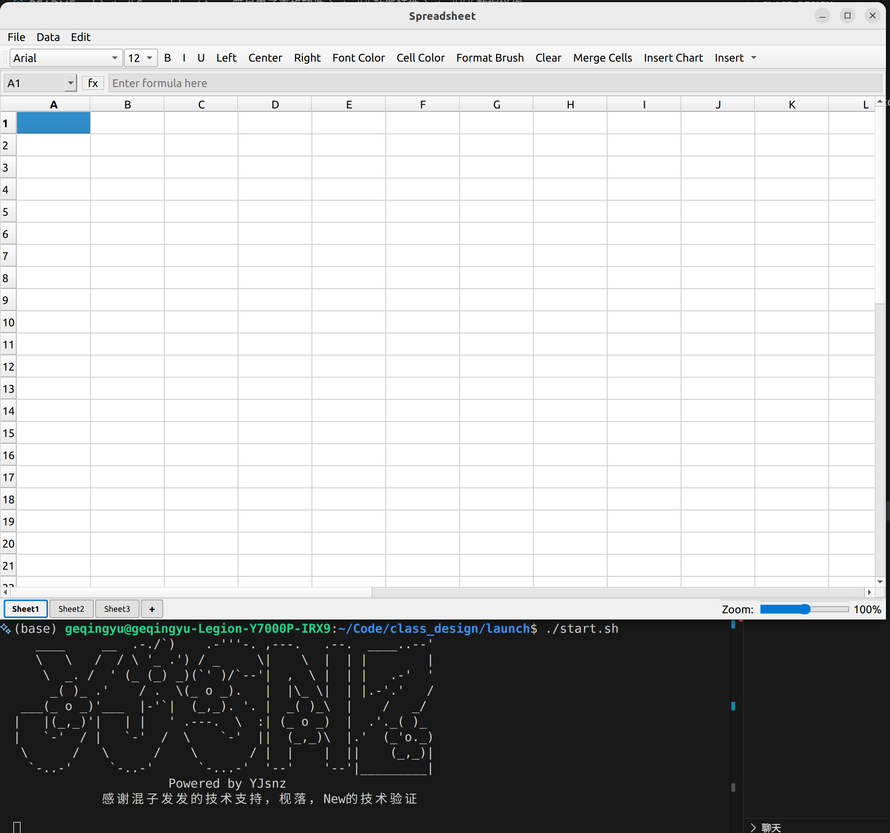

### 基础功能
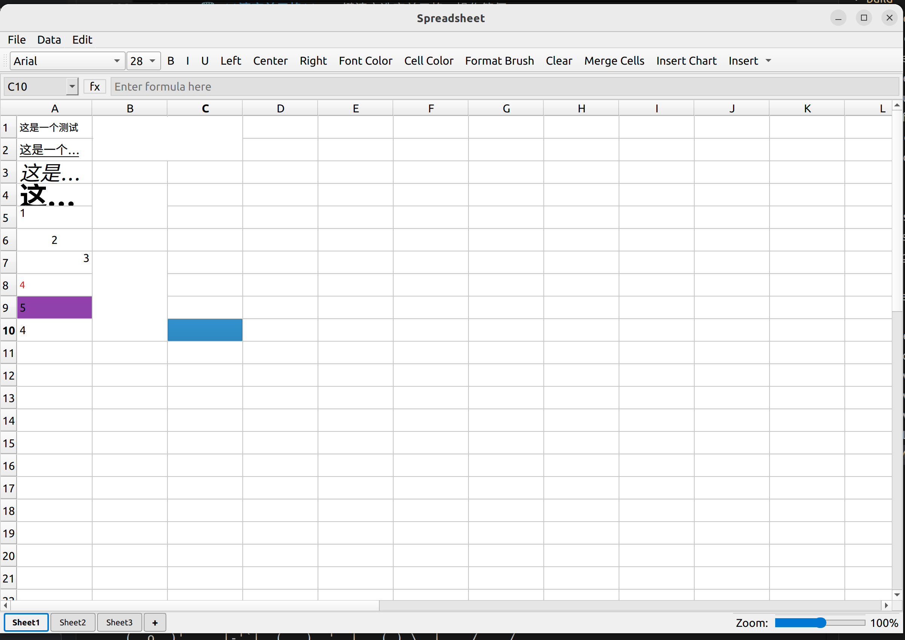

### 多工作表支持
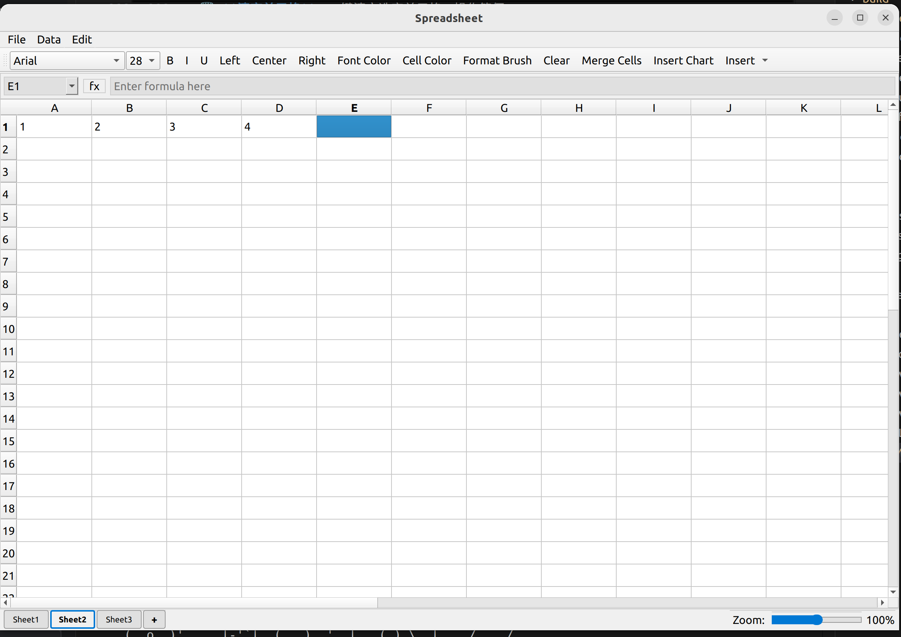

### 文件操作
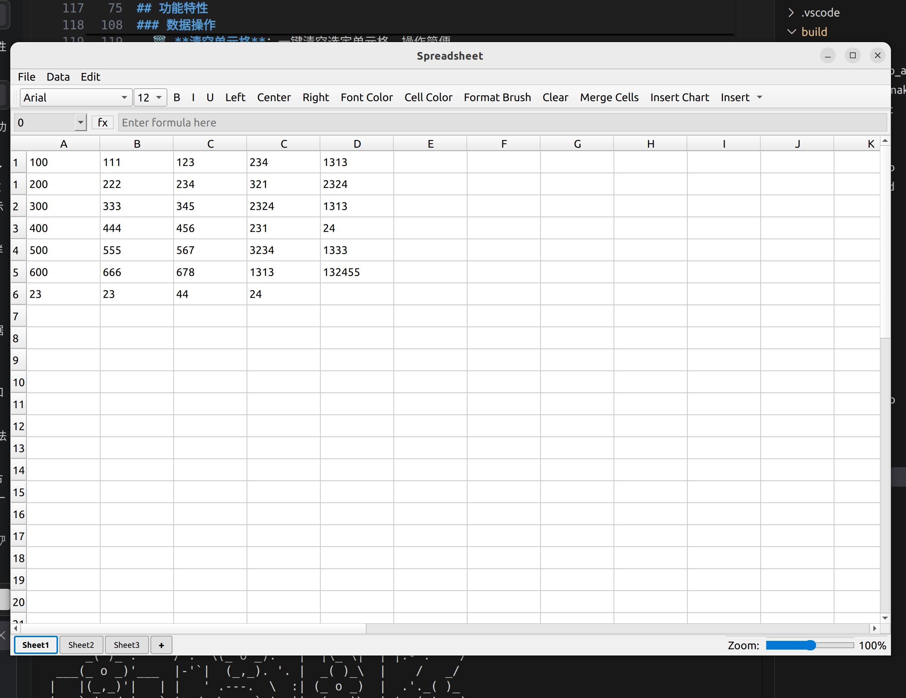
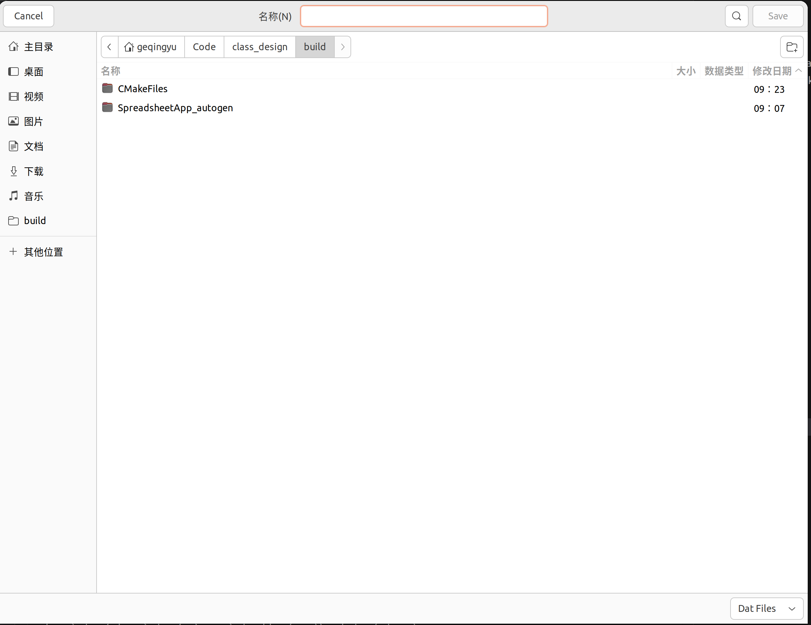

### 数据操作
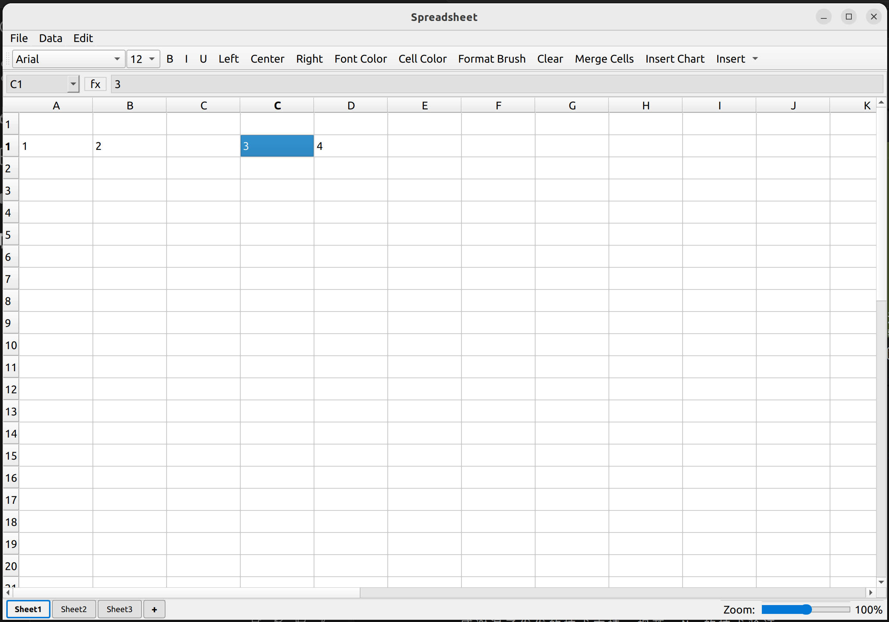
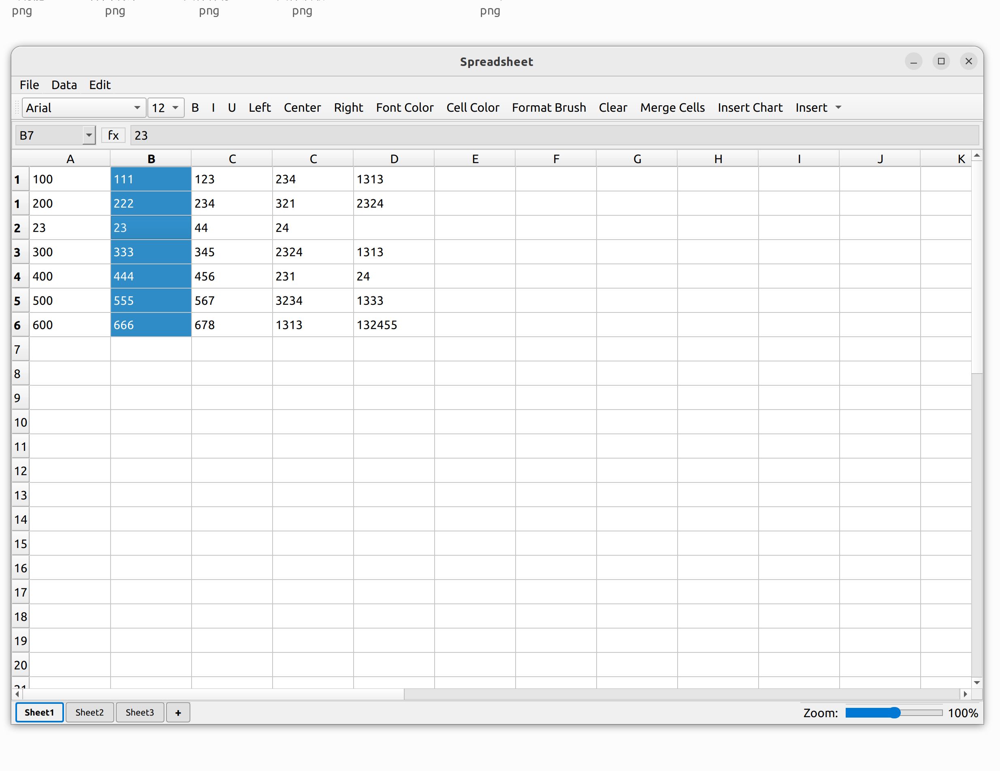
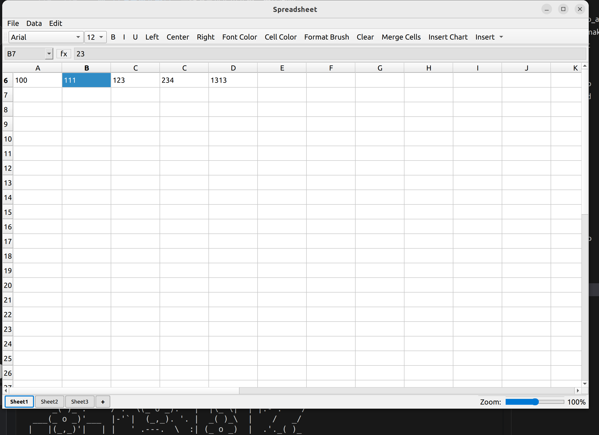
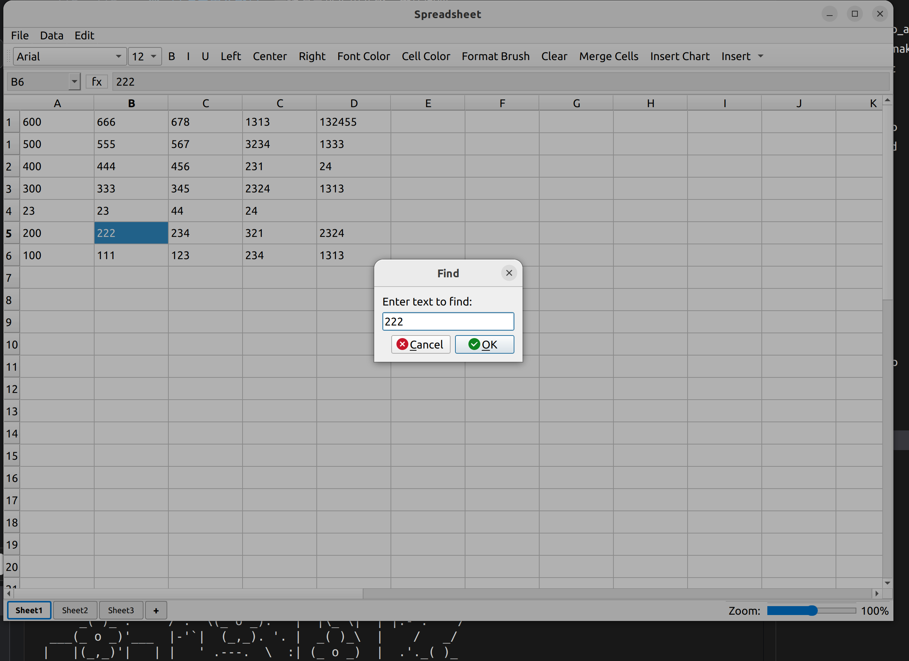
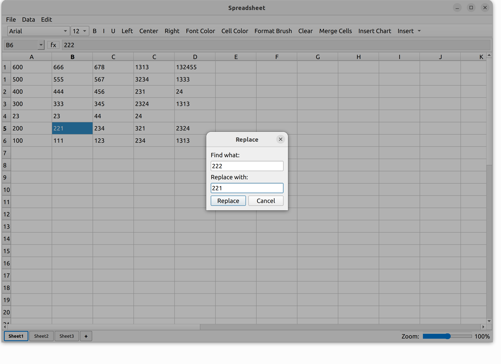

### 图表功能
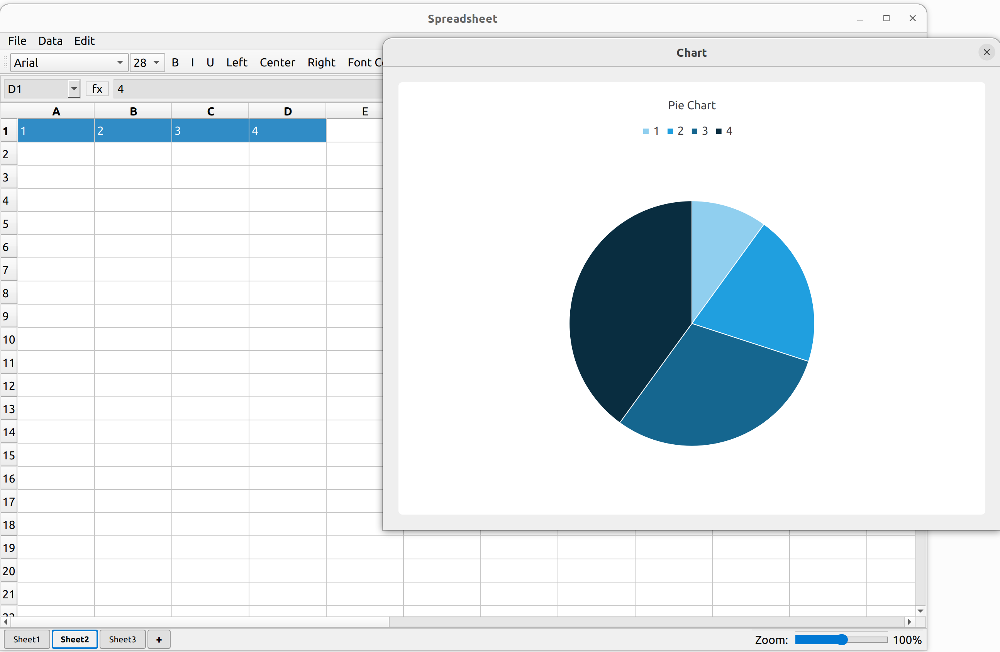

### AI助手功能
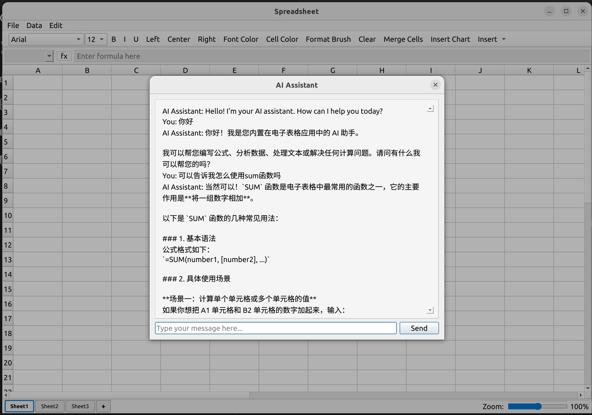


## 环境要求

### 开发环境
- **CMake**: >= 3.16
- **C++ 标准**: C++17
- **Qt 版本**: Qt6 (Widgets, Core, Charts 模块)
- **编译器**: 支持 C++17 的编译器 (GCC, Clang, MSVC)

### 构建工具
- Linux/macOS: `make`, `g++`/`clang++`
- Windows: MinGW 或 MSVC

## 项目结构

```
class_design/
├── CMakeLists.txt          # CMake 配置文件
├── build/                  # 构建输出目录
├── docs/                   # 文档目录
│   ├── program.txt         # 需求文档
│   └── 界面.png            # 界面截图
├── launch/                 # 启动脚本
│   ├── build.sh            # 构建脚本
│   ├── start.sh            # 启动脚本
│   └── storage.sh          # 存储压缩测试脚本
├── src/                    # 源代码目录
│   ├── main.cpp            # 程序入口
│   ├── Spreadsheet.h/.cpp  # 主窗口和 UI 逻辑
│   ├── Cell.h/.cpp         # 单元格数据模型
│   ├── FormulaParser.h/.cpp # 公式解析器
│   └── FileFormat.h/.cpp   # 文件格式处理
├── storage/                # 存储压缩功能
│   ├── CMakeLists.txt      # CMake 配置文件
│   ├── main.cpp            # 程序入口
│   ├── mainwindow.cpp      # 主窗口和 UI 逻辑
│   ├── mainwindow.h        # 主窗口头文件
│   └── mainwindow.ui       # 主窗口 UI 设计
└── README.md               # 项目说明文档
```

### 核心模块说明

1. **main.cpp** - 应用程序入口，创建并显示主窗口
2. **Spreadsheet** - 主窗口类，负责 UI 布局和交互逻辑
3. **Cell** - 单元格类，支持多种数据类型和格式设置
4. **FormulaParser** - 公式解析器，支持数学表达式和函数
5. **FileFormat** - 文件格式处理，支持多种文件格式

### 存储压缩模块说明

1. **storage/main.cpp** - 存储压缩功能的程序入口
2. **storage/mainwindow.cpp** - 存储压缩功能的主窗口和 UI 逻辑，实现多种压缩算法和文件操作
3. **storage/mainwindow.h** - 存储压缩功能的主窗口头文件
4. **storage/mainwindow.ui** - 存储压缩功能的主窗口 UI 设计

## 功能特性

### 基本功能
- 📊 **大容量表格**：支持 32767 行 × 260 列（支持到 ZZ 列），满足大多数办公场景需求
- 📈 **Excel 风格列命名**：采用 A, B, ..., Z, AA, AB, ..., ZZ 命名方式，与 Excel 保持一致
- 📋 **多工作表支持**：默认 3 个工作表，可通过 "+" 按钮灵活添加，方便数据组织
- 📁 **多种数据类型**：
  - 整数
  - 浮点数
  - 字符串
  - 公式

### 公式功能
- ➕ **基本运算符**：支持 `+`, `-`, `*`, `/`, `%` 等基本算术运算
- 📝 **括号优先级**：支持使用括号改变运算优先级，实现复杂表达式计算
- 🔗 **单元格引用**：支持单个单元格引用 (如 A1, B2) 和区域引用 (如 A1:B3)，方便数据关联
- 📊 **数学函数**：支持 sqrt, abs, sin, cos, tan, asin, acos, atan, exp, log, log10, pow, round, ceil, floor 等常用数学函数
- 📈 **统计函数**：支持 sum, avg, max, min, count 等统计函数，方便数据分析
- 🔄 **循环引用检测**：智能检测直接和间接循环引用，错误时返回 `#NA`，避免无限计算
- 📝 **文本函数**：支持 CONCAT, LEFT, RIGHT, MID, UPPER, LOWER, PROPER 等文本处理函数
- 🧠 **逻辑函数**：支持 IF, AND, OR, NOT 等逻辑函数，实现条件判断

### 格式化功能
- 🎨 **字体设置**：
  - 粗体/斜体/下划线
  - 字体大小调整
  - 字体颜色自定义
  - 字体类型选择
- 📐 **对齐方式**：
  - 左对齐/居中/右对齐
- 🌈 **单元格背景色**：支持自定义单元格背景颜色，增强数据可视化效果
- 🖌️ **格式刷**：快速复制格式到其他单元格，提高格式化效率

### 数据操作
- 💾 **文件操作**：
  - 新建文件
  - 打开文件（支持 .dat, .csv, .xlsx 格式）
  - 保存文件
  - 另存为（支持选择 .dat, .csv, .xlsx 格式）
- 🔄 **数据排序**：
  - 升序排序
  - 降序排序
- 🔍 **数据筛选**：快速筛选数据，方便数据查找和分析
- 🔎 **查找和替换**：快速查找和替换内容，提高编辑效率
- 🗑️ **清空单元格**：一键清空选定单元格，操作简便
- 📏 **单元格合并**：支持合并连续单元格，优化数据展示

### 文件压缩功能
- 📁 **CSV文件压缩**：支持对CSV文件进行高效压缩，显著减小文件大小
- 🔧 **多种压缩算法**：
  - zlib压缩（最高压缩级别）
  - Run-Length Encoding (RLE)
  - 字典压缩（针对CSV文件优化）
  - 位级压缩（针对CSV文件优化）
  - 数字专用压缩（针对数字数据优化）
  - 超级压缩（针对特定模式的数字数据）
- 📊 **自动选择最优算法**：自动尝试多种压缩算法，选择压缩率最高的算法
- ✅ **自动解压和比对**：压缩后自动解压并与原始文件比对，确保数据完整性
- 📋 **还原内容预览**：在"还原内容"标签页查看解压后的文件内容
- 📈 **压缩效率显示**：显示压缩前后的文件大小和压缩效率
- 💾 **自动保存**：压缩文件自动保存到build目录，文件名与源文件一致，后缀为.compressed

### 图表功能
- 📊 **多种图表类型**：
  - 柱状图：适合比较不同类别的数据
  - 折线图：适合展示数据随时间的变化趋势
  - 饼图：适合展示数据的占比关系
- 📈 **数据选择**：支持横向和纵向数据选择，灵活适应不同数据布局
- 🤖 **自动数据提取**：自动提取数据并生成图表，简化图表创建流程

### AI助手功能
- 🤖 **智能AI助手**：集成智谱AI的GLM-4.7-Flash模型，提供智能问答和数据分析功能
- 💬 **自然语言交互**：支持自然语言对话，用户可以用自然语言提问
- 📊 **数据分析**：可以帮助用户分析表格数据，提供数据洞察
- 📝 **公式指导**：提供公式使用指导，帮助用户创建复杂公式
- 🔍 **功能建议**：根据用户的操作习惯，提供功能使用建议
- 📚 **上下文理解**：理解电子表格的上下文，提供更相关的回答

## 函数使用方式

### 基本算术运算
| 运算符 | 描述 | 示例 |
|-------|------|------|
| `+` | 加法 | `=A1+B2` |
| `-` | 减法 | `=A1-B2` |
| `*` | 乘法 | `=A1*B2` |
| `/` | 除法 | `=A1/B2` |
| `%` | 取模 | `=A1%B2` |

### 数学函数
| 函数 | 描述 | 示例 |
|------|------|------|
| `sqrt(x)` | 计算平方根 | `=sqrt(A1)` |
| `abs(x)` | 计算绝对值 | `=abs(A1)` |
| `sin(x)` | 计算正弦值（弧度） | `=sin(A1)` |
| `cos(x)` | 计算余弦值（弧度） | `=cos(A1)` |
| `tan(x)` | 计算正切值（弧度） | `=tan(A1)` |
| `asin(x)` | 计算反正弦值（弧度） | `=asin(A1)` |
| `acos(x)` | 计算反余弦值（弧度） | `=acos(A1)` |
| `atan(x)` | 计算反正切值（弧度） | `=atan(A1)` |
| `exp(x)` | 计算指数函数 | `=exp(A1)` |
| `log(x)` | 计算自然对数 | `=log(A1)` |
| `log10(x)` | 计算以10为底的对数 | `=log10(A1)` |
| `pow(x, y)` | 计算x的y次方 | `=pow(A1, 2)` |
| `round(x)` | 四舍五入到整数 | `=round(A1)` |
| `round(x, n)` | 四舍五入到n位小数 | `=round(A1, 2)` |
| `ceil(x)` | 向上取整 | `=ceil(A1)` |
| `floor(x)` | 向下取整 | `=floor(A1)` |

### 统计函数
| 函数 | 描述 | 示例 |
|------|------|------|
| `sum(range)` | 计算指定区域的和 | `=sum(A1:A5)` |
| `avg(range)` | 计算指定区域的平均值 | `=avg(B1:B5)` |
| `max(range)` | 计算指定区域的最大值 | `=max(C1:C10)` |
| `min(range)` | 计算指定区域的最小值 | `=min(D1:D10)` |
| `count(range)` | 计算指定区域的单元格数量 | `=count(E1:E10)` |

### 文本函数
| 函数 | 描述 | 示例 |
|------|------|------|
| `CONCAT(text1, text2, ...)` | 连接多个字符串 | `=CONCAT("Hello", " ", "World")` |
| `LEFT(text, num_chars)` | 提取字符串左侧指定长度的字符 | `=LEFT("Hello", 3)` |
| `RIGHT(text, num_chars)` | 提取字符串右侧指定长度的字符 | `=RIGHT("Hello", 2)` |
| `MID(text, start_num, num_chars)` | 提取字符串中间指定位置和长度的字符 | `=MID("Hello", 2, 3)` |
| `UPPER(text)` | 将字符串转换为大写 | `=UPPER("hello")` |
| `LOWER(text)` | 将字符串转换为小写 | `=LOWER("HELLO")` |
| `PROPER(text)` | 将字符串转换为首字母大写 | `=PROPER("hello world")` |

### 逻辑函数
| 函数 | 描述 | 示例 |
|------|------|------|
| `IF(logical_test, value_if_true, value_if_false)` | 条件判断 | `=IF(A1>10, "大于10", "小于等于10")` |
| `AND(logical1, logical2, ...)` | 逻辑与运算 | `=AND(A1>10, B1<20)` |
| `OR(logical1, logical2, ...)` | 逻辑或运算 | `=OR(A1>10, B1<20)` |
| `NOT(logical)` | 逻辑非运算 | `=NOT(A1>10)` |

### 单元格引用
| 引用类型 | 描述 | 示例 |
|---------|------|------|
| 单个单元格 | 引用单个单元格 | `=A1` |
| 区域引用 | 引用连续的单元格区域 | `=sum(A1:B3)` |

## 功能使用方式

### 单元格合并
1. 选择要合并的连续单元格区域
2. 点击工具栏中的 "Merge Cells" 按钮
3. 选中的单元格将被合并为一个大单元格

### 图表生成
1. 选择要用于生成图表的数据区域
   - 横向选择：多列一行，每个单元格都是一个数据点
   - 纵向选择：多行一列，每个单元格都是一个数据点
   - 矩形选择：第一列是分类，第二列是数值
2. 点击工具栏中的 "Insert Chart" 按钮
3. 在弹出的对话框中选择图表类型（柱状图、折线图或饼图）
4. 点击 "Create Chart" 按钮生成图表
5. 图表将显示在一个新的窗口中

### 文件操作
1. **新建文件**：点击 "File" 菜单中的 "New" 选项
2. **打开文件**：点击 "File" 菜单中的 "Open" 选项，选择要打开的文件（支持 .dat, .csv, .xlsx 格式）
3. **保存文件**：点击 "File" 菜单中的 "Save" 选项
4. **另存为**：点击 "File" 菜单中的 "Save As" 选项，选择保存格式（.dat, .csv, .xlsx）

### 格式化操作
1. **字体设置**：使用工具栏中的字体相关按钮（粗体、斜体、下划线、字体大小、字体类型、字体颜色）
2. **对齐方式**：使用工具栏中的对齐按钮（左对齐、居中、右对齐）
3. **单元格背景色**：点击工具栏中的 "Cell Color" 按钮，选择颜色
4. **格式刷**：点击工具栏中的 "Format Brush" 按钮，然后点击要应用格式的单元格

### 数据操作
1. **排序**：选择要排序的数据区域，点击工具栏中的 "Sort Ascending" 或 "Sort Descending" 按钮
2. **筛选**：点击工具栏中的 "Filter" 按钮，设置筛选条件
3. **查找和替换**：点击工具栏中的 "Find" 或 "Replace" 按钮，输入查找和替换内容
4. **清空单元格**：选择要清空的单元格，点击工具栏中的 "Clear" 按钮

### AI助手功能使用方式
1. **打开AI助手**：点击 "Edit" 菜单中的 "AI Assistant" 选项
2. **输入问题**：在聊天对话框中输入您的问题，例如 "如何使用SUM函数？" 或 "分析一下这个表格的数据"
3. **发送消息**：点击 "Send" 按钮或按 Enter 键发送消息
4. **查看回复**：AI助手会在对话框中显示回复内容
5. **继续对话**：您可以继续输入新的问题，AI助手会根据上下文提供更相关的回答

### 文件压缩功能使用方式
1. **导入CSV文件**：点击 "导入文件" 按钮，选择要压缩的CSV文件
2. **查看表格内容**：文件导入后，在主表格中查看CSV文件的内容
3. **压缩文件**：点击 "压缩文件" 按钮，系统会自动尝试多种压缩算法，选择最优的算法进行压缩
4. **查看压缩结果**：在信息面板中查看压缩前后的文件大小、压缩效率和压缩文件保存路径
5. **查看还原内容**：在 "还原内容" 标签页查看自动解压后的文件内容
6. **验证数据完整性**：系统会自动将解压后的文件与原始文件进行比对，验证数据完整性
7. **查看压缩文件**：压缩文件会自动保存到build目录，文件名与源文件一致，后缀为.compressed

## 快速开始

### 构建项目

#### Linux/macOS
```bash
# 使用构建脚本
chmod +x launch/build.sh
./launch/build.sh

# 或手动构建
mkdir -p build
cd build
cmake ..
make
./SpreadsheetApp
```

#### Windows (MinGW)
```bash
mkdir build
cd build
cmake -G "MinGW Makefiles" ..
mingw32-make
SpreadsheetApp.exe
```

#### Windows (MSVC)
```bash
mkdir build
cd build
cmake -G "Visual Studio 17 2022" ..
cmake --build . --config Release
```

### 运行程序

构建完成后，可执行文件位于 `build/SpreadsheetApp`

### 运行存储压缩功能

```bash
# 使用存储压缩测试脚本
chmod +x launch/storage.sh
./launch/storage.sh

# 或手动构建和运行
cd storage
mkdir -p build
cd build
cmake ..
make
./CSVCompressor
```

## 使用示例

### 公式示例
```
=A1+B2           # 单元格相加
=SUM(A1:A10)     # 区域求和
=AVG(B1:B5)      # 区域平均值
=SQRT(A1)*2      # 平方根计算
=(A1+B2)*C3      # 带括号的表达式
=abs(-10)        # 计算绝对值
=max(A1:A10)     # 计算最大值
```

### 数据类型示例
```
42               # 整数
3.14159          # 浮点数
Hello World      # 字符串
=SUM(A1:A5)      # 公式
```

### 图表示例
1. 在单元格 D1:G1 中输入数据：11, 22, 33, 44
2. 选择这些单元格
3. 点击 "Insert Chart" 按钮
4. 选择 "Bar Chart" 类型
5. 点击 "Create Chart" 按钮
6. 查看生成的柱状图

## 技术亮点

1. **高效的存储格式** - 支持多种文件格式，包括二进制格式、CSV 和 XLSX，适应不同场景需求，平衡存储效率和兼容性
2. **递归下降解析器** - 实现高效的公式解析和计算，支持复杂表达式和多种函数类型
3. **智能循环引用检测** - 自动检测直接和间接循环引用，防止公式循环依赖，提高计算稳定性
4. **Qt6 框架** - 采用现代化的跨平台 GUI 界面，支持 Windows、Linux 和 macOS，提供一致的用户体验
5. **C++17 特性** - 充分利用现代 C++ 特性，如智能指针、lambda 表达式等，提高代码质量和性能
6. **图表功能** - 集成 Qt Charts 模块，支持多种图表类型，实现数据可视化
7. **单元格合并** - 支持合并连续单元格，提升数据展示效果和可读性
8. **多工作表支持** - 支持多个工作表，方便数据组织和管理，适应复杂数据结构
9. **实时数据更新** - 公式修改后自动更新相关单元格的值，确保数据一致性
10. **响应式设计** - 表格支持动态扩展，自动调整行高和列宽，适应不同屏幕尺寸
11. **先进的文件压缩技术** - 实现多种压缩算法，包括 zlib 压缩、RLE、字典压缩、位级压缩、数字专用压缩和超级压缩，针对不同类型的数据自动选择最优算法
12. **智能压缩算法选择** - 自动尝试多种压缩算法，选择压缩率最高的算法，确保最佳压缩效果
13. **数据完整性验证** - 压缩后自动解压并与原始文件比对，确保数据完整性，防止数据损坏
14. **数字数据优化** - 针对数字数据的特点，实现专用的压缩算法，显著提高数字数据的压缩率
15. **紧凑存储格式** - 采用位级优化和变长编码，最大限度减少存储开销，特别适合小型CSV文件
16. **智能AI集成** - 集成智谱AI的GLM-4.7-Flash模型，提供智能问答和数据分析功能，提升用户体验
17. **自然语言处理** - 支持自然语言交互，用户可以用自然语言提问，AI助手能够理解并提供相关回答
18. **网络请求处理** - 实现异步网络请求，确保在发送API请求时界面不会卡顿，提供流畅的用户体验
19. **错误处理机制** - 完善的错误处理机制，确保在API请求失败时能够给用户友好的提示
20. **上下文理解** - AI助手能够理解电子表格的上下文，提供更相关的回答和建议

## 性能指标

- **存储效率**: 支持多种文件格式，二进制格式占用空间小，CSV 格式兼容性好，XLSX 格式功能丰富，适应不同存储需求
- **计算速度**: 优化的公式解析器，快速计算复杂表达式，支持批量数据处理，即使处理大量公式也能保持高效
- **内存占用**: 采用稀疏存储策略，仅存储非空单元格，减少内存使用，适合处理大型电子表格
- **图表渲染**: 使用 Qt Charts 模块，高效渲染图表，支持大数据集，提供流畅的可视化体验
- **界面响应**: 优化的 UI 渲染，即使在处理大量数据时也能保持流畅响应，确保良好的用户体验
- **文件操作**: 支持快速读写文件，处理大型电子表格，提供高效的文件 I/O 操作
- **压缩效率**: 针对CSV文件的多种压缩算法，压缩率可达60%以上，对于数字数据可达到更高的压缩率
- **压缩速度**: 快速压缩算法，即使处理大型CSV文件也能在短时间内完成
- **解压速度**: 高效的解压算法，确保快速还原原始数据
- **数据完整性**: 100%数据还原，确保压缩和解压过程中数据无损失
- **算法适应性**: 自动选择最优压缩算法，适应不同类型的CSV数据，提供最佳压缩效果

## 注意事项

1. **环境要求**：确保已安装 Qt6 开发环境和 Qt Charts 模块
2. **循环引用**：公式中不能出现循环引用，否则会显示 `#NA`
3. **单元格边界**：单元格引用范围不能超过表格边界
4. **公式错误**：错误的公式会显示 `#NA`
5. **图表数据**：图表生成需要选择有效的数据范围
6. **文件格式**：不同文件格式支持的功能可能有所不同
7. **性能建议**：处理大量数据时，建议使用二进制格式存储以获得更好的性能
8. **AI助手配置**：使用AI助手功能需要设置环境变量 `ZHIPUAI_API_KEY` 为您的智谱AI API密钥。如果未设置，将使用默认的API密钥（仅用于开发）

## 许可证

本项目采用 **MIT 许可证**，详见 LICENSE 文件。

```
MIT License

Copyright (c) 2026 YJsnz

Permission is hereby granted, free of charge, to any person obtaining a copy
of this software and associated documentation files (the "Software"), to deal
in the Software without restriction, including without limitation the rights
to use, copy, modify, merge, publish, distribute, sublicense, and/or sell
copies of the Software, and to permit persons to whom the Software is
furnished to do so, subject to the following conditions:

The above copyright notice and this permission notice shall be included in all
copies or substantial portions of the Software.

THE SOFTWARE IS PROVIDED "AS IS", WITHOUT WARRANTY OF ANY KIND, EXPRESS OR
IMPLIED, INCLUDING BUT NOT LIMITED TO THE WARRANTIES OF MERCHANTABILITY,
FITNESS FOR A PARTICULAR PURPOSE AND NONINFRINGEMENT. IN NO EVENT SHALL THE
AUTHORS OR COPYRIGHT HOLDERS BE LIABLE FOR ANY CLAIM, DAMAGES OR OTHER
LIABILITY, WHETHER IN AN ACTION OF CONTRACT, TORT OR OTHERWISE, ARISING FROM,
OUT OF OR IN CONNECTION WITH THE SOFTWARE OR THE USE OR OTHER DEALINGS IN THE
SOFTWARE.
```