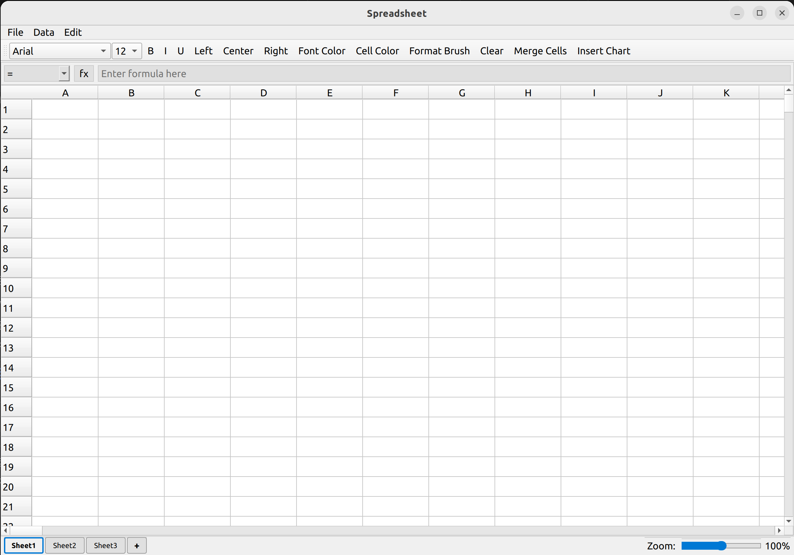

# SpreadsheetApp - 简易电子表格软件

一个基于 Qt6 的 C++ 电子表格应用程序，支持公式计算、单元格格式化、单元格合并和图表生成等功能。
## 项目介绍
```
   ____     __  .-./`)    .-'''-. ,---.   .--.  ____..--' 
   \   \   /  / \ '_ .') / _     \|    \  |  | |        | 
    \  _. /  ' (_ (_) _)(`' )/`--'|  ,  \ |  | |   .-'  ' 
     _( )_ .'    / .  \(_ o _).   |  |\_ \|  | |.-'.'   / 
 ___(_ o _)'___  |-'`|  (_,_). '. |  _( )_\  |    /   _/  
|   |(_,_)'|   | |   ' .---.  \  :| (_ o _)  |  .'._( )_  
|   `-'  / |   `-'  /  \    `-'  ||  (_,_)\  |.'  (_'o._) 
 \      /   \      /    \       / |  |    |  ||    (_,_)| 
  `-..-'     `-..-'      `-...-'  '--'    '--'|_________| 
```

## 界面预览



## 环境要求

### 开发环境
- **CMake**: >= 3.16
- **C++ 标准**: C++17
- **Qt 版本**: Qt6 (Widgets, Core, Charts 模块)
- **编译器**: 支持 C++17 的编译器 (GCC, Clang, MSVC)

### 构建工具
- Linux/macOS: `make`, `g++`/`clang++`
- Windows: MinGW 或 MSVC

## 项目结构

```
class_design/
├── CMakeLists.txt          # CMake 配置文件
├── build/                  # 构建输出目录
├── docs/                   # 文档目录
│   ├── program.txt         # 需求文档
│   └── 界面.png            # 界面截图
├── launch/                 # 启动脚本
│   ├── build.sh            # 构建脚本
│   └── start.sh            # 启动脚本
├── src/                    # 源代码目录
│   ├── main.cpp            # 程序入口
│   ├── Spreadsheet.h/.cpp  # 主窗口和 UI 逻辑
│   ├── Cell.h/.cpp         # 单元格数据模型
│   ├── FormulaParser.h/.cpp # 公式解析器
│   └── FileFormat.h/.cpp   # 文件格式处理
└── README.md               # 项目说明文档
```

### 核心模块说明

1. **main.cpp** - 应用程序入口，创建并显示主窗口
2. **Spreadsheet** - 主窗口类，负责 UI 布局和交互逻辑
3. **Cell** - 单元格类，支持多种数据类型和格式设置
4. **FormulaParser** - 公式解析器，支持数学表达式和函数
5. **FileFormat** - 文件格式处理，支持多种文件格式

## 功能特性

### 基本功能
- ✅ 支持 32767 行 × 260 列的大容量表格（支持到ZZ列）
- ✅ 列号采用 Excel 风格命名 (A, B, ..., Z, AA, AB, ..., ZZ)
- ✅ 多工作表支持，默认3个工作表，可通过"+"按钮添加
- ✅ 支持多种数据类型：
  - 整数
  - 浮点数
  - 字符串
  - 公式

### 公式功能
- ✅ 支持基本运算符：`+`, `-`, `*`, `/`, `%`
- ✅ 支持括号改变优先级
- ✅ 支持单元格引用 (如 A1, B2)
- ✅ 支持区域引用 (如 A1:B3)
- ✅ 支持数学函数
- ✅ 支持统计函数
- ✅ 循环引用检测，错误时返回 `#NA`

### 格式化功能
- ✅ 字体设置：
  - 粗体/斜体/下划线
  - 字体大小调整
  - 字体颜色
  - 字体类型
- ✅ 对齐方式：
  - 左对齐/居中/右对齐
- ✅ 单元格背景色
- ✅ 格式刷功能

### 数据操作
- ✅ 文件操作：
  - 新建文件
  - 打开文件（支持 .dat, .csv, .xlsx 格式）
  - 保存文件
  - 另存为（支持选择 .dat, .csv, .xlsx 格式）
- ✅ 数据排序：
  - 升序排序
  - 降序排序
- ✅ 数据筛选
- ✅ 查找和替换
- ✅ 清空单元格
- ✅ 单元格合并

### 图表功能
- ✅ 支持多种图表类型：
  - 柱状图
  - 折线图
  - 饼图
- ✅ 支持横向和纵向数据选择
- ✅ 自动提取数据并生成图表

## 函数使用方式

### 基本算术运算
| 运算符 | 描述 | 示例 |
|-------|------|------|
| `+` | 加法 | `=A1+B2` |
| `-` | 减法 | `=A1-B2` |
| `*` | 乘法 | `=A1*B2` |
| `/` | 除法 | `=A1/B2` |
| `%` | 取模 | `=A1%B2` |

### 数学函数
| 函数 | 描述 | 示例 |
|------|------|------|
| `sqrt(x)` | 计算平方根 | `=sqrt(A1)` |
| `abs(x)` | 计算绝对值 | `=abs(A1)` |
| `sin(x)` | 计算正弦值（弧度） | `=sin(A1)` |
| `cos(x)` | 计算余弦值（弧度） | `=cos(A1)` |
| `tan(x)` | 计算正切值（弧度） | `=tan(A1)` |
| `asin(x)` | 计算反正弦值（弧度） | `=asin(A1)` |
| `acos(x)` | 计算反余弦值（弧度） | `=acos(A1)` |
| `atan(x)` | 计算反正切值（弧度） | `=atan(A1)` |
| `exp(x)` | 计算指数函数 | `=exp(A1)` |
| `log(x)` | 计算自然对数 | `=log(A1)` |
| `log10(x)` | 计算以10为底的对数 | `=log10(A1)` |
| `pow(x, y)` | 计算x的y次方 | `=pow(A1, 2)` |
| `round(x)` | 四舍五入到整数 | `=round(A1)` |
| `round(x, n)` | 四舍五入到n位小数 | `=round(A1, 2)` |
| `ceil(x)` | 向上取整 | `=ceil(A1)` |
| `floor(x)` | 向下取整 | `=floor(A1)` |

### 统计函数
| 函数 | 描述 | 示例 |
|------|------|------|
| `sum(range)` | 计算指定区域的和 | `=sum(A1:A5)` |
| `avg(range)` | 计算指定区域的平均值 | `=avg(B1:B5)` |
| `max(range)` | 计算指定区域的最大值 | `=max(C1:C10)` |
| `min(range)` | 计算指定区域的最小值 | `=min(D1:D10)` |
| `count(range)` | 计算指定区域的单元格数量 | `=count(E1:E10)` |

### 单元格引用
| 引用类型 | 描述 | 示例 |
|---------|------|------|
| 单个单元格 | 引用单个单元格 | `=A1` |
| 区域引用 | 引用连续的单元格区域 | `=sum(A1:B3)` |

## 功能使用方式

### 单元格合并
1. 选择要合并的连续单元格区域
2. 点击工具栏中的 "Merge Cells" 按钮
3. 选中的单元格将被合并为一个大单元格

### 图表生成
1. 选择要用于生成图表的数据区域
   - 横向选择：多列一行，每个单元格都是一个数据点
   - 纵向选择：多行一列，每个单元格都是一个数据点
   - 矩形选择：第一列是分类，第二列是数值
2. 点击工具栏中的 "Insert Chart" 按钮
3. 在弹出的对话框中选择图表类型（柱状图、折线图或饼图）
4. 点击 "Create Chart" 按钮生成图表
5. 图表将显示在一个新的窗口中

### 文件操作
1. **新建文件**：点击 "File" 菜单中的 "New" 选项
2. **打开文件**：点击 "File" 菜单中的 "Open" 选项，选择要打开的文件（支持 .dat, .csv, .xlsx 格式）
3. **保存文件**：点击 "File" 菜单中的 "Save" 选项
4. **另存为**：点击 "File" 菜单中的 "Save As" 选项，选择保存格式（.dat, .csv, .xlsx）

### 格式化操作
1. **字体设置**：使用工具栏中的字体相关按钮（粗体、斜体、下划线、字体大小、字体类型、字体颜色）
2. **对齐方式**：使用工具栏中的对齐按钮（左对齐、居中、右对齐）
3. **单元格背景色**：点击工具栏中的 "Cell Color" 按钮，选择颜色
4. **格式刷**：点击工具栏中的 "Format Brush" 按钮，然后点击要应用格式的单元格

### 数据操作
1. **排序**：选择要排序的数据区域，点击工具栏中的 "Sort Ascending" 或 "Sort Descending" 按钮
2. **筛选**：点击工具栏中的 "Filter" 按钮，设置筛选条件
3. **查找和替换**：点击工具栏中的 "Find" 或 "Replace" 按钮，输入查找和替换内容
4. **清空单元格**：选择要清空的单元格，点击工具栏中的 "Clear" 按钮

## 快速开始

### 构建项目

#### Linux/macOS
```bash
# 使用构建脚本
chmod +x launch/build.sh
./launch/build.sh

# 或手动构建
mkdir -p build
cd build
cmake ..
make
./SpreadsheetApp
```

#### Windows (MinGW)
```bash
mkdir build
cd build
cmake -G "MinGW Makefiles" ..
mingw32-make
SpreadsheetApp.exe
```

#### Windows (MSVC)
```bash
mkdir build
cd build
cmake -G "Visual Studio 17 2022" ..
cmake --build . --config Release
```

### 运行程序

构建完成后，可执行文件位于 `build/SpreadsheetApp`

## 使用示例

### 公式示例
```
=A1+B2           # 单元格相加
=SUM(A1:A10)     # 区域求和
=AVG(B1:B5)      # 区域平均值
=SQRT(A1)*2      # 平方根计算
=(A1+B2)*C3      # 带括号的表达式
=abs(-10)        # 计算绝对值
=max(A1:A10)     # 计算最大值
```

### 数据类型示例
```
42               # 整数
3.14159          # 浮点数
Hello World      # 字符串
=SUM(A1:A5)      # 公式
```

### 图表示例
1. 在单元格 D1:G1 中输入数据：11, 22, 33, 44
2. 选择这些单元格
3. 点击 "Insert Chart" 按钮
4. 选择 "Bar Chart" 类型
5. 点击 "Create Chart" 按钮
6. 查看生成的柱状图

## 技术亮点

1. **高效的存储格式** - 支持多种文件格式，包括二进制格式、CSV和XLSX
2. **递归下降解析器** - 支持复杂公式解析和计算
3. **循环引用检测** - 防止公式循环依赖
4. **Qt6 框架** - 现代化的跨平台 GUI 界面
5. **C++17 特性** - 使用现代 C++ 特性
6. **图表功能** - 支持多种图表类型，可视化数据
7. **单元格合并** - 支持合并连续单元格

## 性能指标

- **存储效率**: 支持多种文件格式，适应不同场景
- **计算速度**: 优化的公式解析器，快速计算
- **内存占用**: 稀疏存储，仅存储非空单元格
- **图表渲染**: 使用 Qt Charts 模块，高效渲染图表

## 注意事项

1. 确保已安装 Qt6 开发环境和 Qt Charts 模块
2. 公式中不能出现循环引用
3. 单元格引用范围不能超过表格边界
4. 错误公式会显示 `#NA`
5. 图表生成需要选择有效的数据范围

## 许可证

叫声葛哥就给许可